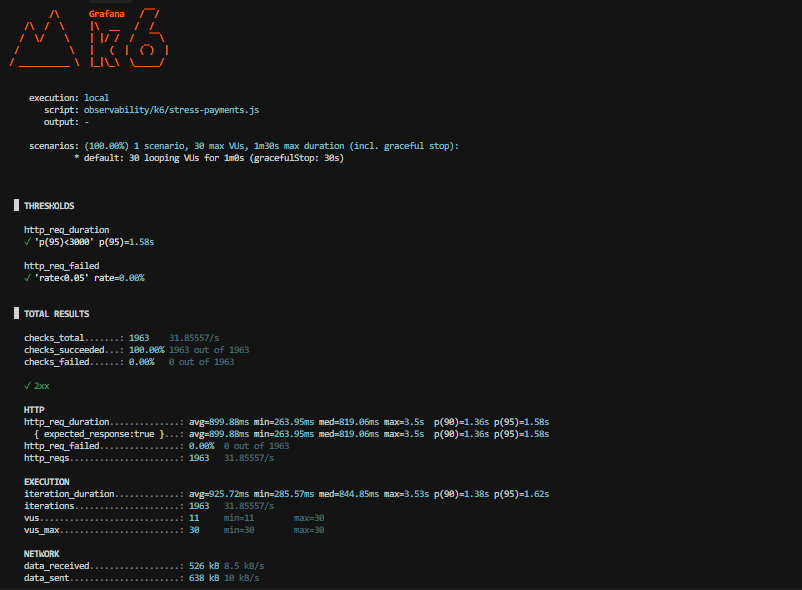
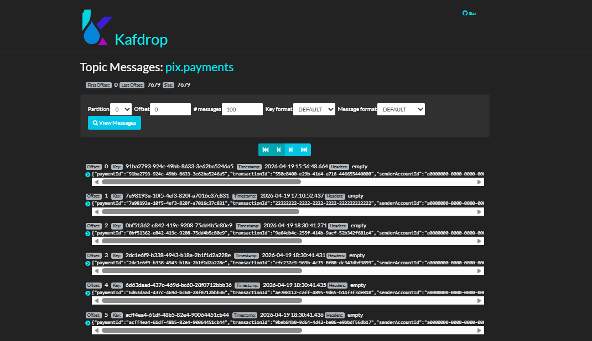
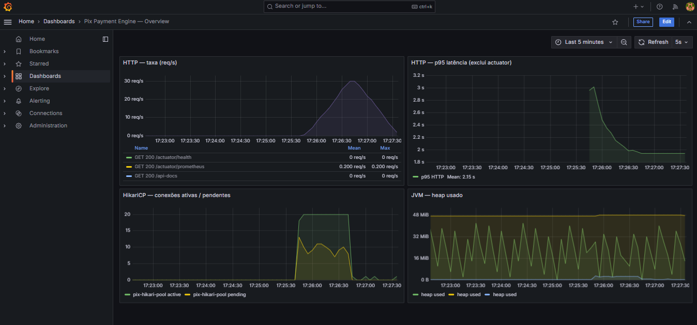

# Pix Payment Engine

Motor de pagamentos Pix de alta concorrência com **exactly-once semantics**, construído sobre Clean Architecture e padrões de sistemas distribuídos.

---

## Sumário

- [O que é](#o-que-é)
- [Arquitetura](#arquitetura)
- [Fluxo de Processamento](#fluxo-de-processamento)
- [Decisões Técnicas](#decisões-técnicas)
- [Stack](#stack)
- [Como Executar](#como-executar)
- [Testes](#testes)
- [Evidências](#evidências)
- [Estrutura de Pastas](#estrutura-de-pastas)
- [Autora](#autora)

---

## O que é

Sistema que processa transferências Pix entre contas com as seguintes garantias:

- **Exactly-once semantics**: o mesmo pagamento jamais é debitado duas vezes, mesmo sob retentativas concorrentes.
- **Zero deadlocks**: aquisição de locks em ordem determinística por UUID.
- **Consistência eventual garantida**: o evento Kafka só é publicado após o commit ACID no PostgreSQL.
- **Resiliência ao Redis**: a indisponibilidade do cache nunca bloqueia o fluxo de pagamento.

---

## Arquitetura

O projeto segue **Clean Architecture (Hexagonal)**: o domínio não conhece nenhum framework. Adapters implementam as portas definidas pelo domínio, e a inversão de dependência é total.

```
┌──────────────────────────────────────────────────────────────────────┐
│  INFRASTRUCTURE                                                      │
│                                                                      │
│  ┌──────────────────┐   ┌───────────────────────────────────────┐   │
│  │  REST Entrypoint │   │  Persistence Adapters                 │   │
│  │  PaymentController   │  AccountRepositoryAdapter             │   │
│  │  @RestController │──▶│  PaymentRepositoryAdapter             │   │
│  │                  │   │  OutboxRepositoryAdapter              │   │
│  └──────────────────┘   └───────────────────────────────────────┘   │
│           │                              │                           │
│           │              ┌───────────────────────────────────────┐   │
│           │              │  Cache Adapter                        │   │
│           │              │  RedisIdempotencyAdapter              │   │
│           │              └───────────────────────────────────────┘   │
│           ▼                              ▼                           │
│  ┌──────────────────────────────────────────────────────────────┐   │
│  │  APPLICATION                                                 │   │
│  │  ProcessPaymentUseCase                                       │   │
│  │   1. Redis fast-path (idempotency check)                     │   │
│  │   2. Pre-validation sem lock (conta existe?)                 │   │
│  │   3. DB fast-path (pagamento já commitado?)                  │   │
│  │   4. FOR UPDATE — ordered UUID lock acquisition              │   │
│  │   5. Re-check idempotência sob lock (TOCTOU guard)           │   │
│  │   6. account.debit() / account.credit()                      │   │
│  │   7. payment.complete() + OutboxRepository.save()            │   │
│  │   8. Commit → Redis.save() (estritamente pós-commit)         │   │
│  └──────────────────────────────────────────────────────────────┘   │
│           │                                                          │
│           ▼                                                          │
│  ┌──────────────────────────────────────────────────────────────┐   │
│  │  DOMAIN  (zero dependências de framework)                    │   │
│  │  Account · Payment · Money · OutboxEvent                     │   │
│  │  Ports: AccountRepository · PaymentRepository                │   │
│  │         OutboxRepository · IdempotencyRepository             │   │
│  └──────────────────────────────────────────────────────────────┘   │
│                                                                      │
│  ┌──────────────────────────────────────────────────────────────┐   │
│  │  OutboxRelayWorker  (@Scheduled every 2s)                    │   │
│  │  SELECT FOR UPDATE SKIP LOCKED → KafkaTemplate → PROCESSED   │   │
│  └──────────────────────────────────────────────────────────────┘   │
└──────────────────────────────────────────────────────────────────────┘
```

---

## Fluxo de Processamento

```
Cliente HTTP
     │
     │  POST /api/v1/payments
     │  X-Idempotency-Key: <uuid>
     ▼
┌─────────────────────────────────────────────────────┐
│  PaymentController                                  │
│  Mapeia request → ProcessPaymentCommand             │
└────────────────────┬────────────────────────────────┘
                     │
                     ▼
┌─────────────────────────────────────────────────────┐
│  ProcessPaymentUseCase                              │
│                                                     │
│  [1] Redis.get(transactionId)                       │
│       HIT  ──▶ return 200 OK  (sub-ms, sem DB)      │
│       MISS ──▶ continua                             │
│                                                     │
│  [2] accountRepository.findById(sender)             │
│      accountRepository.findById(receiver)           │
│       NOT FOUND ──▶ 404 IllegalArgumentException    │
│                                                     │
│  [3] paymentRepository.findByTransactionId()        │
│       FOUND ──▶ rehidrata Redis, return 200 OK      │
│       NOT FOUND ──▶ continua                        │
│                                                     │
│  [4] BEGIN TRANSACTION                              │
│       FOR UPDATE: lock(min(s,r)), lock(max(s,r))    │
│       Re-check idempotência sob lock (TOCTOU)       │
│       sender.debit(amount)                          │
│       receiver.credit(amount)                       │
│       payment.complete()                            │
│       outboxRepository.save(event)                  │
│      COMMIT ◀────────────────────────────────────── │
│                                                     │
│  [5] Redis.save(transactionId, result, TTL=24h)     │
│       return 201 Created                            │
└────────────────────┬────────────────────────────────┘
                     │
     ┌───────────────┘
     │  (assíncrono, a cada 2s)
     ▼
┌─────────────────────────────────────────────────────┐
│  OutboxRelayWorker                                  │
│                                                     │
│  SELECT * FROM outbox_events                        │
│   WHERE status = 'PENDING'                          │
│   ORDER BY created_at ASC                          │
│   FOR UPDATE SKIP LOCKED                            │
│                                                     │
│  kafkaTemplate.send(topic, payload)                 │
│   .whenComplete:                                    │
│     OK  ──▶ UPDATE status = 'PROCESSED'             │
│     ERR ──▶ status permanece PENDING (retry)        │
└─────────────────────────────────────────────────────┘
                     │
                     ▼
             ┌───────────────┐
             │  Kafka Topic  │
             │  pix.payments │
             └───────────────┘
```

---

## Decisões Técnicas

### Idempotência em três camadas

O sistema previne reprocessamento em três pontos distintos, do mais barato ao mais caro:

| Camada | Mecanismo | Custo |
|---|---|---|
| Redis fast-path | `GET pix:idempotency:{uuid}` | Sub-milissegundo, sem I/O de banco |
| DB fast-path | `SELECT payment WHERE transaction_id = ?` (sem lock) | Leitura leve, evita FOR UPDATE em retentativas |
| In-transaction guard | `SELECT payment WHERE transaction_id = ?` após FOR UPDATE | Serializa transações concorrentes (TOCTOU) |

A terceira camada é a guarda autoritativa. As duas primeiras existem para reduzir contenção e latência em retentativas legítimas.

### Pessimistic Locking sem Deadlock

Transferências envolvem dois registros (sender e receiver). Para prevenir deadlock circular entre transações concorrentes, os locks são sempre adquiridos na mesma ordem:

```java
List<UUID> orderedIds = Stream.of(senderAccountId, receiverAccountId)
        .sorted()
        .toList();
```

Duas transações `A→B` e `B→A` disputando os mesmos IDs sempre tentarão adquirir o lock do UUID menor primeiro. Não há inversão de ordem — logo, não há deadlock.

### Transactional Outbox Pattern

Dual Write — escrever em banco e publicar no Kafka em operações separadas — introduz inconsistência eventual não controlada: se o sistema falhar entre os dois passos, o evento é perdido ou duplicado.

A solução é atômica: o evento é inserido na tabela `outbox_events` **dentro da mesma transação** que debita e credita as contas. O `OutboxRelayWorker` lê eventos pendentes com `FOR UPDATE SKIP LOCKED` e publica no Kafka em loop separado. O status só muda para `PROCESSED` no callback de sucesso do Kafka.

Isso garante **at-least-once delivery** sem perda: se o Kafka estiver indisponível, o evento permanece `PENDING` e é retentado no próximo ciclo.

### TransactionTemplate vs @Transactional

O `ProcessPaymentUseCase` usa `TransactionTemplate` programaticamente, não `@Transactional` declarativo. Isso permite controlar com precisão quando o commit ocorre: o Redis é populado **após** o retorno de `transactionTemplate.execute()`, nunca durante. Com `@Transactional`, o Spring gerencia o commit implicitamente e não há garantia de ordem entre commit e cache.

O mesmo se aplica ao `OutboxRelayWorker`: o callback `whenComplete` do Kafka roda em uma thread do Kafka client, fora do contexto AOP do Spring. `TransactionTemplate` é a única forma de abrir uma nova transação nesse contexto.

### Virtual Threads (Java 21)

`spring.threads.virtual.enabled: true` substitui o pool de threads da plataforma (Tomcat) por Virtual Threads. Sob carga de I/O-bound (esperas por locks de banco, chamadas Redis, Kafka), Virtual Threads eliminam o custo de context switch de threads pesadas, permitindo alta concorrência com um pool HikariCP reduzido (20 conexões).

---

## Stack

| Componente | Tecnologia | Versão |
|---|---|---|
| Linguagem | Java | 21 (Virtual Threads) |
| Framework | Spring Boot | 3.4 |
| Persistência | Spring Data JPA + PostgreSQL | 16 |
| Cache / Idempotência | Spring Data Redis + Lettuce | 7 |
| Mensageria | Apache Kafka + Spring Kafka | 3.8 |
| Migrations | Flyway | — (gerenciado pelo BOM) |
| Observabilidade | Micrometer + Prometheus + Grafana | — |
| Documentação API | SpringDoc OpenAPI 3 / Swagger UI | 2.7 |
| Testes | JUnit 5 + AssertJ + Mockito + Testcontainers | — |
| Build | Maven Wrapper | 3.9 |

---

## Como Executar

### Pré-requisitos

- Java 21+
- Docker Desktop

### 1. Subir a infraestrutura

```bash
docker compose up -d
```

Serviços iniciados: PostgreSQL, Redis, Kafka, Zookeeper, Kafdrop, Prometheus, Grafana.

```bash
docker compose ps
```

Aguarde todos exibirem `healthy` ou `running`.

### 2. Subir a aplicação

```bash
./mvnw spring-boot:run
```

A aplicação sobe na porta `8080`. O Flyway executa as migrations automaticamente.

### 3. Inserir contas de teste

```bash
docker exec -it pix-postgres psql -U pix_user -d pix_engine -c "
INSERT INTO accounts (id, pix_key, balance, currency, status) VALUES
  ('a0000000-0000-0000-0000-000000000001', 'sender@pix.com',   1000.00, 'BRL', 'ACTIVE'),
  ('b0000000-0000-0000-0000-000000000002', 'receiver@pix.com',    0.00, 'BRL', 'ACTIVE');"
```

### 4. Processar um pagamento

```bash
curl -X POST http://localhost:8080/api/v1/payments \
  -H "Content-Type: application/json" \
  -H "X-Idempotency-Key: f47ac10b-58cc-4372-a567-0e02b2c3d479" \
  -d '{
    "senderAccountId":   "a0000000-0000-0000-0000-000000000001",
    "receiverAccountId": "b0000000-0000-0000-0000-000000000002",
    "amount": 100.00
  }'
```

**Primeira chamada — `201 Created`:**
```json
{ "paymentId": "...", "transactionId": "f47ac10b-...", "status": "COMPLETED", "created": true }
```

**Segunda chamada com o mesmo `X-Idempotency-Key` — `200 OK`:**
```json
{ "paymentId": "...", "transactionId": "f47ac10b-...", "status": "COMPLETED", "created": false }
```

### 5. URLs locais

| Serviço | URL |
|---|---|
| API | http://localhost:8080 |
| Swagger UI | http://localhost:8080/swagger-ui.html |
| Actuator Health | http://localhost:8080/actuator/health |
| Kafdrop | http://localhost:9000 |
| Prometheus | http://localhost:9090 |
| Grafana | http://localhost:3000 (admin / admin) |

---

## Testes

A estratégia de testes é dividida em três níveis com responsabilidades distintas, separados por plugins Maven para que cada nível possa ser executado de forma independente.

### Nível 1 — Testes unitários (sem Docker)

```bash
./mvnw test
```

Executados pelo **Maven Surefire**. Sem Spring context, sem banco, sem Docker. Rodam em milissegundos e validam as invariantes do domínio de forma isolada.

| Classe | O que valida |
|---|---|
| `MoneyTest` | Criação com amount negativo/nulo, moeda nula/branca, `add`, `subtract`, `isGreaterThanOrEqualTo`, moedas diferentes lançam exceção |
| `AccountTest` | `debit` reduz saldo, `credit` aumenta saldo, saldo insuficiente lança `InsufficientFundsException`, conta inativa bloqueia débito e crédito |
| `PaymentTest` | Status inicial `PENDING`, `complete()` transita para `COMPLETED`, `fail()` transita para `FAILED`, transições duplas lançam `IllegalStateException` |
| `PaymentControllerTest` | HTTP 201 (novo pagamento), 200 (idempotente), 422 (saldo insuficiente), 404 (conta inexistente / pix key inválida), 400 (header ausente, campo nulo, valor negativo) |

---

### Nível 2 — Testes de integração (requer Docker)

```bash
./mvnw verify
```

Executados pelo **Maven Failsafe**. Sobem PostgreSQL 16 e Redis 7 via **Testcontainers** com o padrão Singleton Container (um único container por JVM, compartilhado entre todos os testes). O Kafka é mockado via `@MockitoBean OutboxRelayWorker` para isolar o domínio de pagamentos da mensageria.

#### `ProcessPaymentUseCaseIntegrationTest`

Valida o fluxo de pagamento com banco real:

| Cenário | Verificação |
|---|---|
| Pagamento válido | Saldo debitado, saldo creditado, `payment.status = COMPLETED`, 1 registro em `outbox_events` com `status = PENDING` |
| Idempotência via DB | Mesma `transactionId` duas vezes: segundo request retorna `created = false` sem novo débito |
| Saldo insuficiente | `InsufficientFundsException` lançada, zero linhas em `payments` e `outbox_events`, saldo inalterado |
| Atomicidade do Outbox | `outbox_events.aggregate_id` = `payments.id` (mesma transação) |

#### `IdempotencyIntegrationTest`

Valida as três camadas de idempotência com Redis real:

| Cenário | Verificação |
|---|---|
| Redis HIT | Segunda chamada servida do cache sem acesso ao banco; saldo alterado apenas uma vez; `created = false` |
| Redis eviction → DB fallback | Redis esvaziado após primeiro commit; segunda chamada encontra pagamento no banco e rehidrata o cache |
| Pre-transaction fast-path | Redis vazio + pagamento já no Postgres: use case resolve via `SELECT` sem `FOR UPDATE`, sem débito extra, Redis repovoado |

> O terceiro cenário é o mais crítico: valida que o sistema não adquire row locks desnecessários em retentativas, mesmo quando o cache foi perdido.

---

### Nível 3 — Teste de carga (k6)

```bash
k6 run observability/k6/stress-payments.js
```

30 VUs simultâneos por 60 segundos. Carga distribuída entre 4 pares de contas para simular isolamento por usuário e reduzir contenção de locks.

Thresholds validados:

| Métrica | Threshold | Resultado |
|---|---|---|
| `http_req_failed` | `< 0.05%` | `0.00%` |
| `http_req_duration p(95)` | `< 3000ms` | `1.58s` |

---

## Evidências

### Contrato da API e Idempotência

O vídeo demonstra o comportamento do sistema frente a retentativas com o mesmo `X-Idempotency-Key`:

- **Primeira requisição**: Redis miss → processamento completo → `201 Created` com `created: true`.
- **Segunda requisição (mesmo key)**: Redis hit → retorno imediato sem tocar o banco → `200 OK` com `created: false`.

https://github.com/user-attachments/assets/api-contract-swagger.mp4

> Para reproduzir localmente: acesse http://localhost:8080/swagger-ui.html, execute `POST /api/v1/payments` duas vezes com o mesmo `X-Idempotency-Key`.

---

### Resultado do teste de carga (k6)



**Resultados:** `http_req_failed: 0.00%` e `p(95) = 1.58s` com 30 VUs concorrentes.

O teste distribui carga entre 4 pares de contas (`a↔b`, `c1↔c2`, `d1↔d2`, `e1↔e2`). Essa distribuição simula isolamento por usuário e reduz contenção de row locks. O Pessimistic Locking com ordered UUID acquisition garantiu zero deadlocks durante toda a execução.

---

### Kafdrop — Transactional Outbox em produção



O dashboard Kafdrop ([http://localhost:9000](http://localhost:9000)) exibe as mensagens publicadas no tópico `pix.payments` pelo `OutboxRelayWorker`.

Cada mensagem representa um evento `PAYMENT_COMPLETED` que foi:
1. Inserido em `outbox_events` **atomicamente** com o débito/crédito das contas.
2. Lido pelo relay com `SELECT FOR UPDATE SKIP LOCKED`.
3. Publicado no Kafka e marcado `PROCESSED` somente no callback de sucesso.

Essa sequência elimina o Dual Write: não existe janela de tempo onde o banco está atualizado mas o evento não foi enviado, ou vice-versa.

---

### Grafana — Observabilidade



O dashboard ([http://localhost:3000](http://localhost:3000)) expõe quatro métricas críticas durante o teste de carga:

| Painel | O que mede | Por que importa |
|---|---|---|
| HTTP — taxa (req/s) | Throughput por status e URI | Valida que o sistema mantém vazão sob carga |
| HTTP — p95 latência | 95º percentil de latência por URI | Detecta degradação de performance; threshold de SLA |
| HikariCP — conexões ativas/pendentes | Uso do pool de conexões PostgreSQL | Identifica saturação do pool (gargalo de DB) |
| JVM — heap usado | Memória heap usada | Detecta memory leaks e pressão de GC |

A otimização de escopo transacional — pre-validações e DB fast-path fora da transação — reduziu o tempo médio com row locks ativos, refletindo diretamente na melhoria do p95.

---

## Estrutura de Pastas

```
pix-payment-engine/
├── src/
│   ├── main/
│   │   ├── java/com/pix/engine/
│   │   │   ├── PixPaymentEngineApplication.java
│   │   │   ├── domain/
│   │   │   │   ├── exception/          # InsufficientFundsException, InvalidPixKeyException
│   │   │   │   ├── model/              # Account, Payment, Money (Record), OutboxEvent, enums
│   │   │   │   └── port/out/           # AccountRepository, PaymentRepository,
│   │   │   │                           # OutboxRepository, IdempotencyRepository
│   │   │   ├── application/
│   │   │   │   └── usecase/            # ProcessPaymentUseCase, Command, Result
│   │   │   └── infrastructure/
│   │   │       ├── cache/              # RedisIdempotencyAdapter
│   │   │       ├── configuration/      # OpenApiConfiguration, SchedulingConfiguration
│   │   │       ├── entrypoint/rest/    # PaymentController, PaymentRequest,
│   │   │       │                       # PaymentControllerAdvice
│   │   │       ├── messaging/          # OutboxRelayWorker
│   │   │       └── persistence/
│   │   │           ├── adapter/        # AccountRepositoryAdapter, PaymentRepositoryAdapter,
│   │   │           │                   # OutboxRepositoryAdapter
│   │   │           ├── entity/         # AccountEntity, PaymentEntity, OutboxEntity
│   │   │           ├── mapper/         # AccountMapper, PaymentMapper, OutboxMapper
│   │   │           └── repository/     # AccountJpaRepository, PaymentJpaRepository,
│   │   │                               # OutboxJpaRepository
│   │   └── resources/
│   │       ├── application.yml
│   │       └── db/migration/
│   │           └── V1__init_schema.sql
│   └── test/
│       └── java/com/pix/engine/
│           ├── AbstractIntegrationTest.java
│           ├── domain/model/           # MoneyTest, AccountTest, PaymentTest
│           ├── application/usecase/    # ProcessPaymentUseCaseIntegrationTest,
│           │                           # IdempotencyIntegrationTest
│           └── infrastructure/rest/    # PaymentControllerTest
├── observability/
│   ├── grafana/                        # Provisioning de datasource e dashboard
│   ├── k6/                             # stress-payments.js
│   ├── prometheus/                     # prometheus.yml
│   └── README.md
├── assets/                             # Screenshots e vídeos de evidência
├── postman/                            # Collection e environment para testes manuais
├── docker-compose.yml
├── Dockerfile
├── pom.xml
└── .gitignore
```

---

## Autora

<table>
  <tr>
    <td align="center">
      <a href="https://github.com/akporto">
        <br/>
        <sub><b>Ana Kellen Porto</b></sub>
      </a><br/>
      <a href="https://github.com/akporto">GitHub</a> ·
      <a href="https://www.linkedin.com/in/ana-kellen-nogueira-porto/">LinkedIn</a>
    </td>
  </tr>
</table>

Software Developer com foco em backend, cloud e arquiteturas distribuídas. Este projeto foi desenvolvido como simulador de alta concorrência aplicando Clean Architecture, padrões de consistência transacional e observabilidade em sistemas financeiros.
